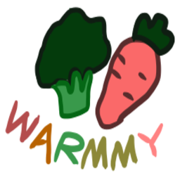
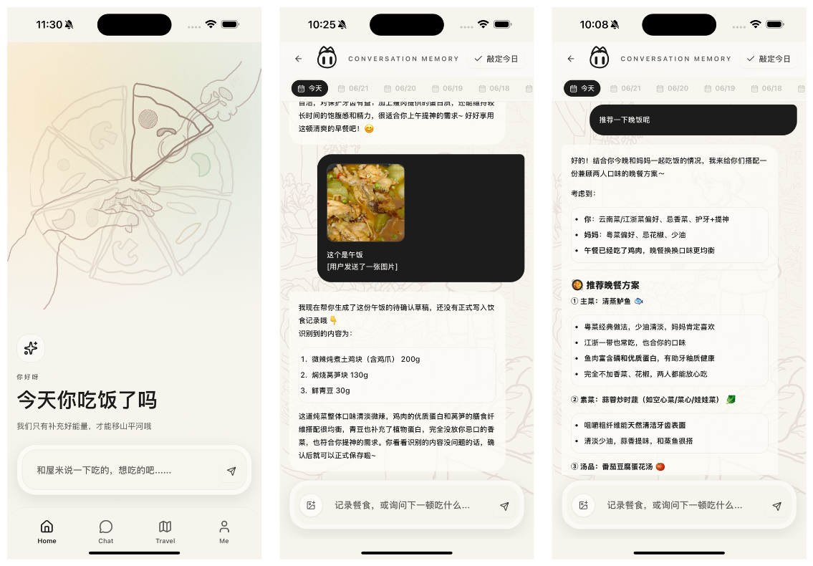
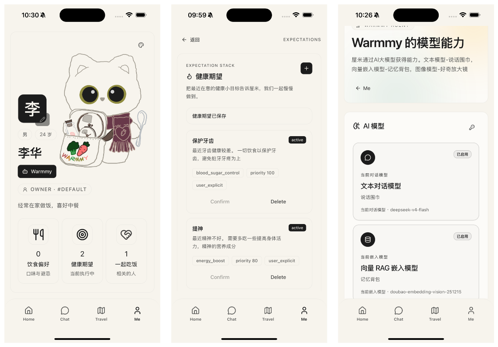
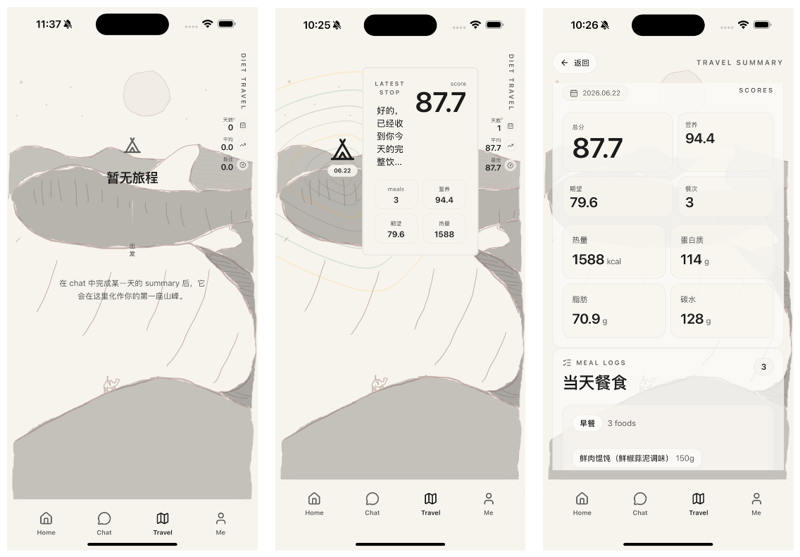
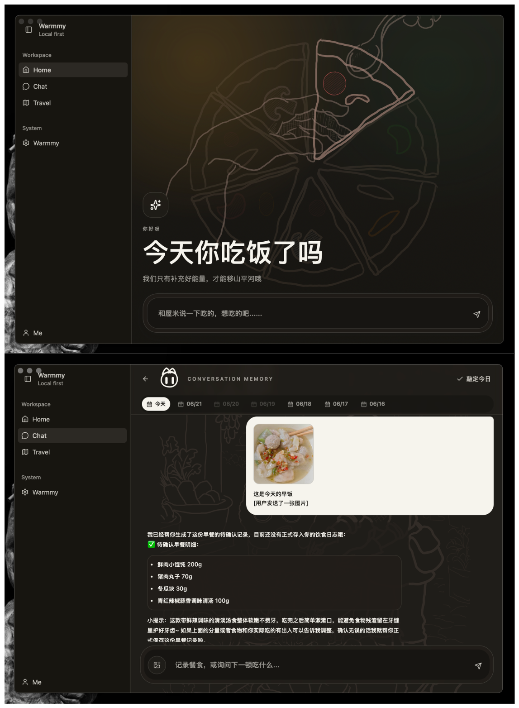

  

<h1 align="center">Warmmy 屋米</h1>

  温暖的日常饮食伙伴，活在电子空间的饭搭子。

  <a href="https://zhiyanzhaijie.github.io/warmmy/">Home</a>
  ·
  <a href="https://github.com/zhiyanzhaijie/warmmy/releases/latest">Release</a>
  ·
  <a href="#介绍">介绍</a>
  ·
  <a href="#功能">功能</a>
  ·
  <a href="#多端的应用支持">多端支持</a>
  ·
  <a href="#开源">开源</a>

## 介绍

**Warmmy 屋米** 是一个 Rust 生态构建的多端 Agentic 饮食助手，支持 `Windows、macOS、iOS、Android 和 Web`。
它是温暖的日常饮食伙伴，活在电子空间的饭搭子。  

> 作为开源应用，屋米的对话**完全本地**，隐私和开销由你自行掌控。

## 功能

### 吃饭是头等大事

屋米从交流中为你记录每日的饮食生活。它可以:
- 记录饮食
- 推荐与评分
- 从对话中了解与记忆你的喜好，经历

  

### 陪伴式体验

屋米关注你的**饮食偏好，健康计划，亲密关系以及你的经历**。  
它是专属于你的饮食伙伴，关心你的饮食健康。

所有的记忆都将存储在你设备本地(Local First)。

  

### 食物之旅

根据你的饮食经历，屋米给出记录与打分。  

在食物世界里，屋米陪伴你攀登一座又一座的山峰。

  

## 多端支持

Warmmy 屋米使用 Rust 生态的 [Dioxus](https://github.com/dioxuslabs/dioxus) 框架构建，一份核心代码支撑多端体验。

它优先支持:
- 手机端应用 Android 与 iOS(后续将会通过 App Store 发布)。
- Desktop
- Web (官网入口)

  

## 开源

Warmmy 是一个免费的开源应用(当然，屋米的Token消耗由用户自行负担)。

**License:** 本项目采用 [PolyForm Noncommercial License 1.0.0](LICENSE)。

这意味着你可以为了学习、研究、个人使用和非商业目的阅读、运行、修改与分发 warmmy 的代码，但不能将其用于商业目的，也不能基于本项目进行商业化二次开发。
